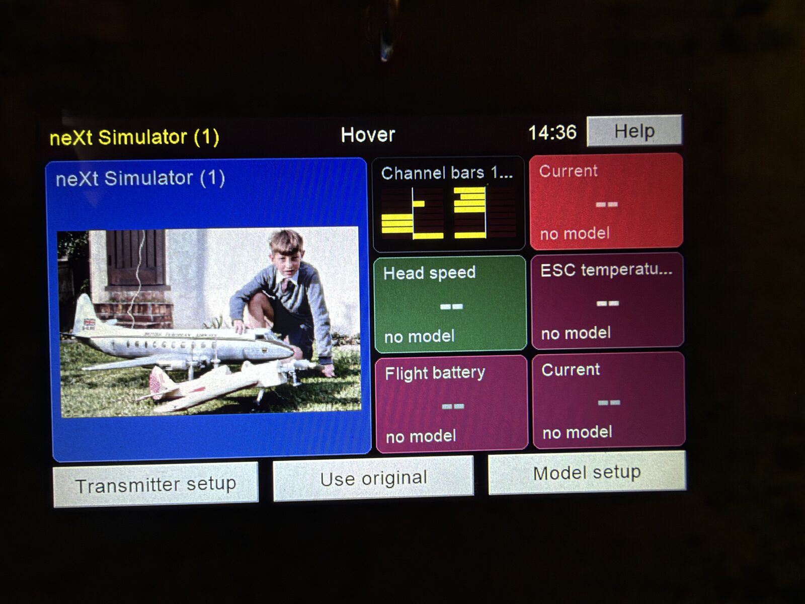

# The Version 2 transmitter's screen



The screen of the Version 2 transmitter is an Elecrow **CrowPanel 5.0**: an ESP32-S3
(WROOM-1-N4R8: 4 MB flash, 8 MB PSRAM) with a 5-inch 800 × 480 RGB display, GT911 capacitive
touch, WiFi, an NS4168 speaker amplifier, a microSD slot and a UART port on the back. This
firmware makes it a **Nextion emulator**: the Teensy 4.1 goes on sending the Nextion display
commands it always has (at 921 600 baud), and the screen draws the transmitter's 58 pages from
their definitions on its card, answering with exactly the bytes the Nextion sent. On top of
that it has pages of its own: updates, WiFi, themes, the flight screen, the picture chooser,
and Pong.

What is in this folder:

| | |
|---|---|
| `src/main.cpp` | The emulator: the serial protocol, the pages and their components, the little script interpreter's host, drawing, touch, WiFi, the web tools, the workshop door |
| `src/*_device.h`, `src/*_draw.h` | The screen's own pages (update, wifi, pics, flight, theme, pong): the part that touches the hardware, and the drawing |
| `lib/Ldrc*` | The same pages' thinking, portable C++ with no Arduino in it, tested on a Mac: `LdrcUpdate`, `LdrcWifi`, `LdrcPics`, `LdrcFlight`, `LdrcTheme`, `LdrcLink` (the framed file link to the Teensy, identical to the Teensy's copy) |
| `lib/NextionScript`, `lib/NextionFonts` | The interpreter for the pages' own event code, and the Nextion font format |
| `sd/` | **Everything on the screen's card**: `hmi/pages/*.json` (the pages), `hmi/pic/` (the pages' pictures), `hmi/font*_aa.bin` (the fonts), `hmi/audio/` (the sounds), `hmi/web/` (the pages the phone sees), `images/` (model pictures) |
| `hmi/` | How `sd/` is made: `extract_hmi.py` decodes the Version 1 Nextion project, `build_sd.py` writes the card, `pagestyle.py` and `overrides.json` restyle the pages, `render_host/` draws any page on the Mac, `test_*/` are the host tests, `README.md` documents the Nextion file format |
| `dev/` | Tools used from a Mac with the workshop door open: `teensy_ota.py` (the Teensy through the screen: hello, install, backup, restore, rollback), `screen.py`, `nextion_send.py`, `preview_page.py` |
| `platformio.ini` | The builds |

## Build and flash, once

1. Install [PlatformIO](https://platformio.org/). The CrowPanel's USB-C port is a CH340 serial
   chip; on a Mac or Windows you may need its driver.
2. Put a **blank microSD card, formatted FAT32**, in the panel's slot before it is powered: the
   card is mounted at power-up only.
3. Flash over USB:

```
cd TXV2-Screen
pio run -e crowpanel50 -t upload --upload-port /dev/cu.usbserial-XXXX
```

(`pio device list` names the port.) The `crowpanel50` build is the published firmware; the
`ota` build is the same firmware pushed over WiFi, for later.

4. **First start.** With an empty card the screen has nothing to show but its update panel,
   and it says so: *No WiFi yet*. Its first button opens the **WiFi page**, where you pick a
   network and type its password on the screen; it is kept in the chip, never on the card.
   The screen then offers the latest release on messiter.com and fetches it: the whole card
   (some 240 files, 44 MB, about seven minutes) and the published firmware. Done, it restarts
   as a complete screen. (Or copy `sd/` to the card first, and it fetches only what differs.)
5. **Connect it to the Teensy.** The panel's UART0 port on the back (IO44 RX, IO43 TX, GND)
   goes to the Teensy's Serial1 (pin 0 RX1 to the panel's TX, pin 1 TX1 to the panel's RX):
   the Version 1 board's Nextion header. Both are 3.3 V logic. Power the panel with 5 V on its
   USB-C socket; the pins of its ports are 3.3 V outputs, not power inputs. The speaker goes
   on the SPK port.

From then on the transmitter updates itself: *Transmitter setup → Transmitter updates*.

## The workshop door

A published screen answers nothing on the network but `GET /status`, and accepts no firmware
from a computer, until its **door** is opened: hold the top right corner of the screen for
three seconds. With the door open, from the same WiFi:

```
pio run -e ota -t upload --upload-port <the screen's IP>     # firmware over the air
python3 dev/teensy_ota.py hello                              # the Teensy, through the screen
python3 dev/screen.py --help                                 # screenshots, pages, the log
```

Every POST to the screen needs the header `X-LDRC: 1`. The door stays open on that one
network until the same hold shuts it, and is shut on every other network. `/status` says
the screen's version, WiFi and card; `/bootlog` and `/recent` are its logs.

## Safety

The screen's radio is **off whenever the model could be flying**: the Teensy says so on
the wire (`ldrcst=`), and the screen obeys. No update, no file link, no firmware
is accepted while a model is connected. The Teensy's firmware installs on trial: if the new
one does not stay up, the previous one comes back by itself.

## The wire

Besides the Nextion protocol, a handful of words pass between the boards on the same UART:

| Direction | Words | Meaning |
|---|---|---|
| Teensy → screen | `ldrcst=<bits>` | The transmitter's state: model connected, motor armed, safety, and so on |
| Teensy → screen | `ldrcrx=...` | The connected receiver's version and update progress, once a second |
| Teensy → screen | `pong=x,y,ly,ry`, `pong=start` | Pong's ball and paddles, once a frame; the screen draws it smoothly |
| Screen → Teensy | `ldrc update`, `ldrc rxupdate`, `ldrc wifi`, `ldrc appearance`, `ldrc colours`, `ldrc flight`, `ldrc defined` | The screen's own buttons, placed on the Teensy's pages by `hmi/overrides.json` |
| Screen → Teensy | `TIME=<epoch>` | The local time, from the internet; the Teensy sets its clock module from it |
| Screen → Teensy | `LDRCLINK` | Opens the framed file link (`lib/LdrcLink`): files on the Teensy's card, and firmware |
| Screen → Teensy | `LDRCRXUP major minor patch` | Orders the connected receiver to update itself |
| Screen → Teensy | `LDRCIMG <name>` | The picture chosen for the model |

## Tests and the renderer

`hmi/test_all.sh` runs every host test (they need a C++ compiler, nothing else) and the
release tool's gate. `hmi/render_pages.py` draws every page with the screen's own drawing
code on the Mac, so a change is seen before it goes near the transmitter, and
`hmi/lint_pages.py` looks for overlaps and clipped text.

## Builds in platformio.ini

| Build | What for |
|---|---|
| `crowpanel50` | The published firmware, flashed over USB |
| `ota` | The same, pushed over WiFi (door open) |
| `ota_dev` | A bench build that calls itself `dev`, so the transmitter always offers the published one over it |
| `ota_test_fail_trial`, `ota_test_fall_over` | Builds meant to fail, to prove the fall-back |
| `ota_seed`, `usb_seed` | Malcolm's bench builds: they need an `include/secrets.h` with his networks, which is not published |

## Licence

Code GPL-3.0-or-later, pages, pictures and sounds CC BY-SA 4.0: [../LICENSING.md](../LICENSING.md).
Copyright (C) 2026 Malcolm Messiter. Third-party libraries (Arduino GFX, SensorLib,
ArduinoJson) keep their own licences.
