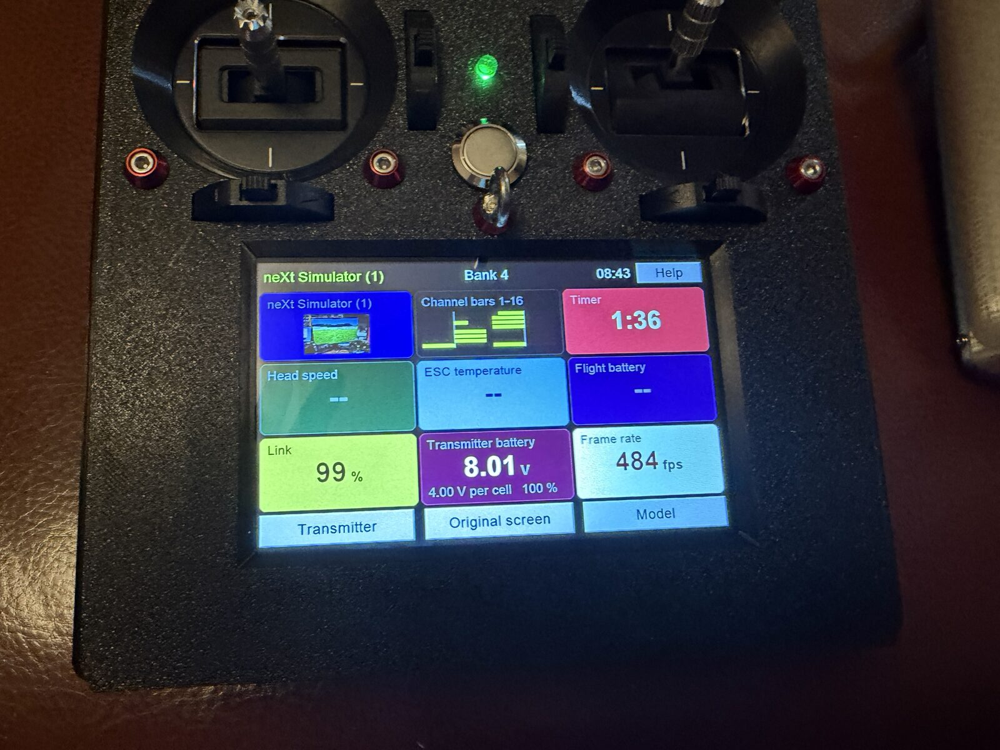

# The Version 2 transmitter



The Version 2 transmitter is the Version 1 transmitter with a new screen. Its Teensy 4.1
motherboard, its Ebyte ML01DP5 radio module, its gimbals, switches and case are those of
Version 1, so a Version 1 transmitter becomes a Version 2 by changing the display and
updating the firmware. The display is an Elecrow **CrowPanel 5.0**: an ESP32-S3 with a
5-inch 800 × 480 capacitive touchscreen, WiFi, a speaker amplifier and a microSD slot.
It speaks the Nextion display's serial protocol to the Teensy, so the Teensy's code
drives the same 58 pages as before, and the screen draws them itself, with WiFi and
features of its own on top. The screen's firmware is in [../TXV2-Screen](../TXV2-Screen).

What is in this folder:

| | |
|---|---|
| `TransmitterCode/` | The Teensy 4.1 firmware (PlatformIO). `include/` holds nearly all of it, one header per subject; `src/main.cpp` is setup and the main loop |
| `TransmitterCode/SD Examples/Teensy SD Example/` | What goes on the Teensy's microSD card |
| `Help files for SD/` | The help texts, one for each screen, as the release tool publishes them |
| `Noises/` | The sound files: voice messages, prompts, and the sound effects to choose from |
| `Circuits/` | The circuit boards as Proteus projects, with Gerbers in the `CADCAM` folders |
| `STL files/` | The 3D-printed case, as STL and STEP |
| `Images/` | Photographs |
| `dev/` | Malcolm's tools: the release tool, the firmware packager, the publisher of this folder |
| `V1B-UPDATES.md` | The change log, release by release (Version 2 was called Version 1B while it was being made) |

## Parts

Everything Version 1 needs, with one change: the **Nextion NX8048P050 is replaced by an
Elecrow CrowPanel 5.0** (the ESP32-S3-WROOM-1-N4R8 version: 4 MB flash, 8 MB PSRAM). The
screen needs a **microSD card of its own** (any size; it is formatted FAT32 and the
screen fills it). The USB-C 2S charger is optional; Version 1's micro-USB charger does.

| Category | Item | Notes | Qty |
|---|---|---|---|
| PCB & Modules | Printed circuit board | Gerbers in `Circuits/Transmitter - CADCAM` | 1 |
| PCB & Modules | Teensy 4.1 | Main microcontroller | 1 |
| PCB & Modules | Elecrow CrowPanel 5.0 | ESP32-S3 N4R8, 800 × 480 capacitive touch | 1 |
| PCB & Modules | microSD card for the Teensy | exFAT or FAT32 | 1 |
| PCB & Modules | microSD card for the screen | FAT32, the screen fills it | 1 |
| PCB & Modules | ML01DP5 | Ebyte 2.4 GHz radio module | 1 |
| PCB & Modules | Pololu 2808 | Electronic power switch | 1 |
| PCB & Modules | RTC module | I2C, DS1307 (the screen sets it from the internet) | 1 |
| Power | Voltage regulator | Pololu 5 V 1 A S13V10F5 or 7805 | 2 |
| Power | AMS1117 3.3 V regulator | | 1 |
| Power | Charger | 2S balanced, micro-USB or a USB-C module | 1 |
| Power | LiPo battery | 2S, a suitable size | 1 |
| Power | Diodes | 1N5406 ×2, 1N4001 ×2 | 4 |
| Passives | Electrolytic capacitors | 330 µF, 100 µF | 1 each |
| Passives | Tantalum capacitors | 330 µF 0E907 ×2, 47 µF 1206 ×2 | 4 |
| Passives | Ceramic capacitors | 330 nF ×2, 100 nF ×4, 10 µF ×1, all 1206 | 7 |
| Controls | FrSky M9 gimbals | Hall sensor | 2 |
| Controls | FrSky trim switches | From the X9D Plus | 4 |
| Controls | RC switches | Three-position; up to four can be knobs instead | 8 |
| Controls | Push button | 16 mm vandal-resistant, momentary | 1 |
| Structural | RGB LED | 5 mm, common anode | 1 |
| Structural | Speaker | 4 Ω or 8 Ω, on the screen's SPK port | 1 |
| Structural | Antenna | RP-SMA 2.4 GHz, with a 20 cm RP-SMA extension | 1 |
| Structural | Case | `STL files/`, PETG or what you prefer | |
| Connectors | Headers, servo cable, DuPont connectors, 2 × 4 socket | Various | |

## The Teensy

**Build and flash** with [PlatformIO](https://platformio.org/) (the VS Code extension or the
`pio` command). The Teensy on USB:

```
cd TXV2/TransmitterCode
pio run -e teensy41 -t upload
```

PlatformIO fetches the libraries named in `platformio.ini` and runs the Teensy loader.
This is the only time the Teensy needs a USB cable: after that its firmware comes
through the screen (below).

**The card.** Copy the contents of `TransmitterCode/SD Examples/Teensy SD Example` to
the Teensy's microSD card: `help/` (the help texts), `Images/` (the model pictures the
example models name), `mod/` (model backups) and `MODELS.DAT`, and make an empty `log/`
folder. The example `MODELS.DAT` and `mod/` hold Malcolm's models; you may start with
them or let the transmitter make its own. Keep the card in the Teensy's own slot.

## The screen

Build, flash and connect the screen as [../TXV2-Screen/README.md](../TXV2-Screen/README.md)
says. The screen plugs into the Teensy's serial port, where the Nextion was, and is
powered from the board's 5 V. The transmitter's speaker moves to the screen's SPK port.

## Updates after the first flash

**Transmitter setup → Transmitter updates.** The screen fetches the latest release from
[messiter.com/txv1b/release](https://messiter.com/txv1b/release/) over WiFi and installs
what differs: its own firmware, the files on its card, the Teensy's firmware (sent over
the serial link and flashed by the Teensy itself, with the previous firmware kept to
fall back to) and the help texts. It never touches the pilot's own files: the models
and their backups are copied to the screen's card for safety before the Teensy's
firmware is replaced, and nothing of the pilot's is ever published.

No update runs while a model is connected, and the screen's WiFi is off whenever the
model could be flying: control in the air comes first.

**Version 2 receivers** can be updated through the transmitter too: *Model setup →
Receiver updates*, with the model switched on and connected.

## How the two boards talk

The Teensy sends Nextion commands at 921 600 baud: `page`, `vis`, `X.txt=`, `X.val=`,
`get`, and the rest. The screen draws the pages from their definitions on its card
(decoded from the Version 1 Nextion project; see `../TXV2-Screen/hmi/README.md`) and
answers with exactly the bytes the Nextion sent, so the Teensy's code did not need to
know the display had changed. The screen's own features (updates, WiFi, themes, the
flight screen, pictures, Pong) are a few extra commands and replies on the same wire,
listed in [../TXV2-Screen/README.md](../TXV2-Screen/README.md).

## Change log

[V1B-UPDATES.md](V1B-UPDATES.md), newest first. The transmitter's own build is named
`B<n>` and the screen's `<major>.<minor>.<patch>`; a release names both.

## Licence

The Teensy firmware is **GPL-2.0-or-later** ([LICENSE](LICENSE)), as Version 1 is: it links
the RF24 radio driver, which is GPL-2.0 only. Boards CERN-OHL-S-2.0; help texts, sounds,
case files and pictures CC BY-SA 4.0. The screen's firmware is GPL-3.0-or-later. Details in
[../LICENSING.md](../LICENSING.md). Copyright (C) 2020-2026 Malcolm Messiter.
